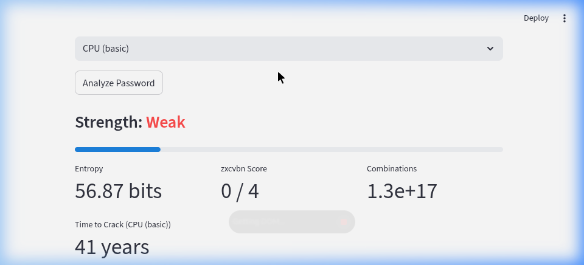
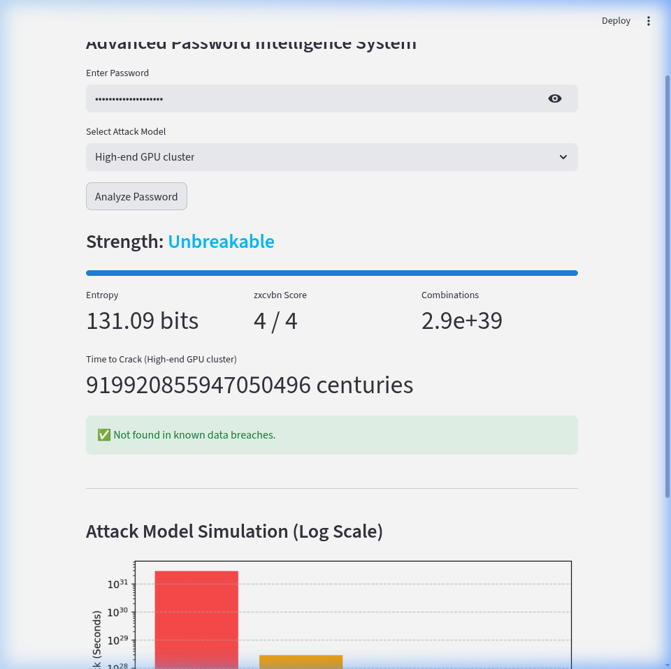

# 🧠 Entropy Engine
**Advanced Password Intelligence & Attack Simulation System**

[

**Live Demo:** (https://entropymodel.streamlit.app/)

## 🎥 Demo Video

A security-focused password analysis platform that combines mathematical entropy modeling, realistic brute-force attack simulation, pattern detection (zxcvbn), and breach intelligence (HaveIBeenPwned API) into a unified system.

Built with both a Tkinter desktop application and a Streamlit web interface, the Entropy Engine demonstrates applied cryptographic theory, real-world attack modeling, and secure API integration.

🚀 Why This Project Matters

Most password strength checkers rely on superficial rules like “8 characters minimum” or “add a symbol.”
This system goes further by:

Modeling realistic attacker hardware

Measuring true entropy

Detecting predictable human patterns

Verifying exposure against real-world data breaches

Visualizing exponential cracking timelines

It bridges theory and practical cybersecurity engineering.

🔐 Core Capabilities
1️⃣ Mathematical Entropy Engine

Calculates entropy using:

Entropy = length × log₂(charset_size)

Automatically detects character classes:

Lowercase (26)

Uppercase (26)

Digits (10)

Symbols (~32)

Computes total combinations:

charset_size ^ length

Estimates time-to-crack against multiple hardware models

2️⃣ Realistic Attack Model Simulation

Selectable brute-force environments:

Attack Model	Guesses per Second
CPU (Basic)	10⁸
Gaming GPU	10¹¹
High-End GPU Cluster	10¹²
Nation-State Infrastructure	10¹⁵

Crack time dynamically updates based on selected adversary capability.

3️⃣ Pattern & Dictionary Analysis (zxcvbn)

Integrates zxcvbn to detect:

Dictionary words

Common substitutions (P@ssw0rd)

Keyboard sequences

Repeated patterns

Known weak structures

Prevents false security from artificially inflated entropy.

4️⃣ Secure Breach Intelligence (HaveIBeenPwned)

Implements SHA-1 k-anonymity model:

Password is hashed locally.

Only first 5 hash characters are transmitted.

API returns matching suffixes.

Breach count displayed if matched.

✔ Raw passwords are never transmitted
✔ Uses HTTPS
✔ Zero password logging

5️⃣ Log-Scale Crack-Time Visualization

Matplotlib-based visualization:

X-axis: Attack Models

Y-axis: Time-to-crack (logarithmic scale)

Clearly demonstrates exponential security differences

Makes brute-force math visually intuitive.

🖥 Dual Interface Architecture
Desktop Application

Built with Tkinter

Local execution

Interactive analysis

Secure by default (no external dependency required unless breach check enabled)

Web Application

Built using Streamlit

Deployable to Streamlit Community Cloud

HTTPS secured

Modular architecture separating logic from UI

🧱 Technical Stack

Python 3.10+

Tkinter

Streamlit

zxcvbn

matplotlib

requests

hashlib

Modular architecture (core logic separated from interface layer)

🏗 Project Structure
entropy_engine/
│
├── core/
│   ├── entropy.py
│   ├── attack_models.py
│   ├── breach_check.py
│   ├── strength_logic.py
│
├── gui_tkinter.py
├── web_streamlit.py
├── requirements.txt
└── README.md

## 📊 Example Analysis

### Weak Password: `password123`

- **Entropy:** ~56 bits
- **zxcvbn Score:** 0/4
- **Found in breaches:** Yes
- **Result:** Instantly cracked using GPU-level hardware

### Strong Password: `Tr0ub4dor&P@ssw0rd!^`

- **Entropy:** ~131 bits
- **zxcvbn Score:** 4/4
- **Found in breaches:** No
- **Estimated Crack Time:** ~9.1 × 10¹⁷ centuries (High-End GPU Cluster)

## 🏆 Benchmark Comparison

How Entropy Engine compares to standard mechanisms commonly found on the web:

| Feature | Entropy Engine | Generic Regex UI | Basic `zxcvbn` | Enterprise Cloud Manager |
| :--- | :--- | :--- | :--- | :--- |
| **Mathematical True Entropy** | ✅ Detailed (bits) | ❌ Binary Pass/Fail | ❌ Simple Heuristics | ❌ Opaque Score |
| **Realistic Hardware Sims** | ✅ Dynamic (GPU/CPU) | ❌ None | ⚠️ Static CPU Baseline | ❌ None |
| **Pattern & Dictionary Matches** | ✅ Yes | ❌ Regex rules only | ✅ Yes | ✅ Yes |
| **Breach Database Check** | ✅ k-Anonymity (API) | ❌ None | ❌ None | ✅ Secure Sync |
| **Local Offline Privacy** | ✅ Fully Functional Offline | ✅ Local | ✅ Local | ❌ Requires Cloud Ping |

## 🛠 Installation
git clone https://github.com/yourusername/entropy_engine.git
cd entropy_engine
pip install -r requirements.txt

Run Desktop Version:

python gui_tkinter.py

Run Web Version:

streamlit run web_streamlit.py
☁ Deployment (Streamlit Cloud)

Push to public GitHub repository

Connect repository to Streamlit Community Cloud

Set entry file: web_streamlit.py

Deploy

Application runs securely over HTTPS.

🔒 Security Considerations

No password storage

No logging of user inputs

SHA-1 k-anonymity breach lookup

HTTPS-only API requests

Fully functional offline (without breach check)

📈 Skills Demonstrated

Applied cryptography principles

Entropy modeling & combinatorics

Adversary simulation

Secure API consumption

Data visualization (logarithmic scaling)

Desktop + Web application development

Modular architecture design

Defensive security engineering
